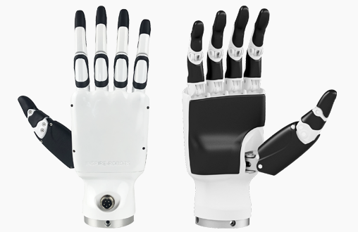
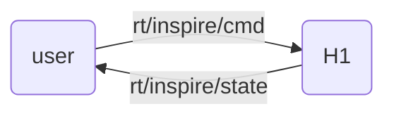

<div align="center">
  <h1 align="center">DFX Inspire Hand service</h1>
  <a href="https://www.unitree.com/" target="_blank">
    
  </a>
</div>

# 1. 📦 Introduction

[Unitree Robot RH56DFX Inspire Hand](https://support.unitree.com/home/en/H1_developer/Dexterous_hand) Controller.

<div align="center">
  
</div>


The user sends `unitree_go::msg::dds::MotorCmds_` messages to the `rt/inspire/cmd` topic to control the dexterous hand,
and receives `unitree_go::msg::dds::MotorStates_` messages from the `rt/inspire/state` topic to obtain its status.



The IDL data is an array containing joint-level values for all 12 motors of both hands.
Currently the dexterous hand only supports joint control, i.e. only the parameter `q` makes sense in the idl format. The others are reserved.


<div style="text-align: center;">
<table border="1">
  <tr>
    <td>Id</td>
    <td>0</td>
    <td>1</td>
    <td>2</td>
    <td>3</td>
    <td>4</td>
    <td>5</td>
    <td>6</td>
    <td>7</td>
    <td>8</td>
    <td>9</td>
    <td>10</td>
    <td>11</td>
  </tr>
  <tr>
    <td rowspan="2">Joint</td>
    <td colspan="6">Right Hand</td>
    <td colspan="6">Left Hand</td>
  </tr>
  <tr>
    <td>pinky</td>
    <td>ring</td>
    <td>middle</td>
    <td>index</td>
    <td>thumb-bend</td>
    <td>thumb-rotation</td>
    <td>pinky</td>
    <td>ring</td>
    <td>middle</td>
    <td>index</td>
    <td>thumb-bend</td>
    <td>thumb-rotation</td>
  </tr>
</table>
</div>


# 2. 🚀 Launch

## unitree h1
```bash
# Build project
mkdir build & cd build
cmake ..
make -j6
# Terminal 1. Run h1 inspire hand service
sudo ./inspire_h1 -s /dev/ttyUSB0
# Terminal 2. Run example
./hand_example
```

## unitree g1
```bash
# Build project
mkdir build & cd build
cmake ..
make -j6
# Terminal 1. Run g1 inspire hand service
# The serial port name is hard-coded; if it doesn’t match your setup, please edit it directly in the source.
sudo ./inspire_g1
# Terminal 2. Run example
./hand_example
```

# FAQ
1. Error when `make -j6`
    ```bash
    ...
    /usr/bin/ld: inspire_ctrl.cpp:(.text._Z14serialize_intoIN10unitree_go3msg4dds_12MotorStates_EN3org7eclipse10cyclonedds4core3cdr14xcdr_v2_streamEEbPvmRKT_b[_Z14serialize_intoIN10unitree_go3msg4dds_12MotorStates_EN3org7eclipse10cyclonedds4core3cdr14xcdr_v2_streamEEbPvmRKT_b]+0x2be): undefined reference to `org::eclipse::cyclonedds::core::cdr::xcdr_v2_stream::finish_member(org::eclipse::cyclonedds::core::cdr::entity_properties&, bool)'
    /usr/bin/ld: inspire_ctrl.cpp:(.text._Z14serialize_intoIN10unitree_go3msg4dds_12MotorStates_EN3org7eclipse10cyclonedds4core3cdr14xcdr_v2_streamEEbPvmRKT_b[_Z14serialize_intoIN10unitree_go3msg4dds_12MotorStates_EN3org7eclipse10cyclonedds4core3cdr14xcdr_v2_streamEEbPvmRKT_b]+0x2d9): undefined reference to `org::eclipse::cyclonedds::core::cdr::xcdr_v2_stream::finish_struct(org::eclipse::cyclonedds::core::cdr::entity_properties&)'
    
    ```
    please compile and install `unitree_sdk2`:
    ```bash
    cd ~
    git clone https://github.com/unitreerobotics/unitree_sdk2
    cd unitree_sdk2
    mkdir build & cd build
    cmake ..
    sudo make install
    ```
2. Error when run `sudo ./inspire_h1 -s /dev/ttyUSB0` or `sudo ./inspire_g1`
    ```bash
    --- Unitree Robotics --- 
    Inspire Hand Controller  
    Open serial port /dev/ttyUSB* failed
    ```
    For **Unitree h1**, use the `-s` parameter to change the serial port name.  
    For **Unitree g1**, modify the serial port name directly in the source code.
